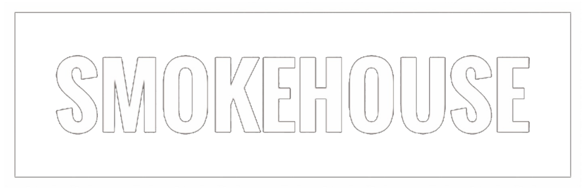
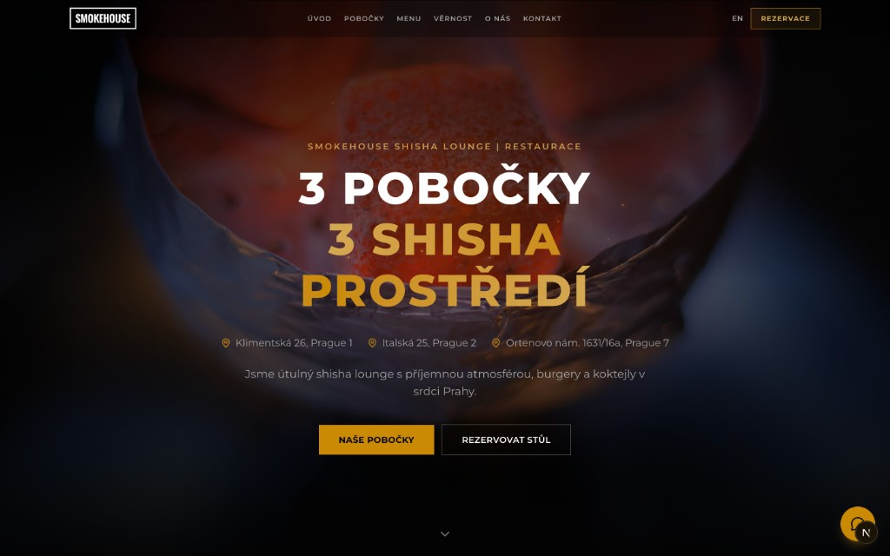
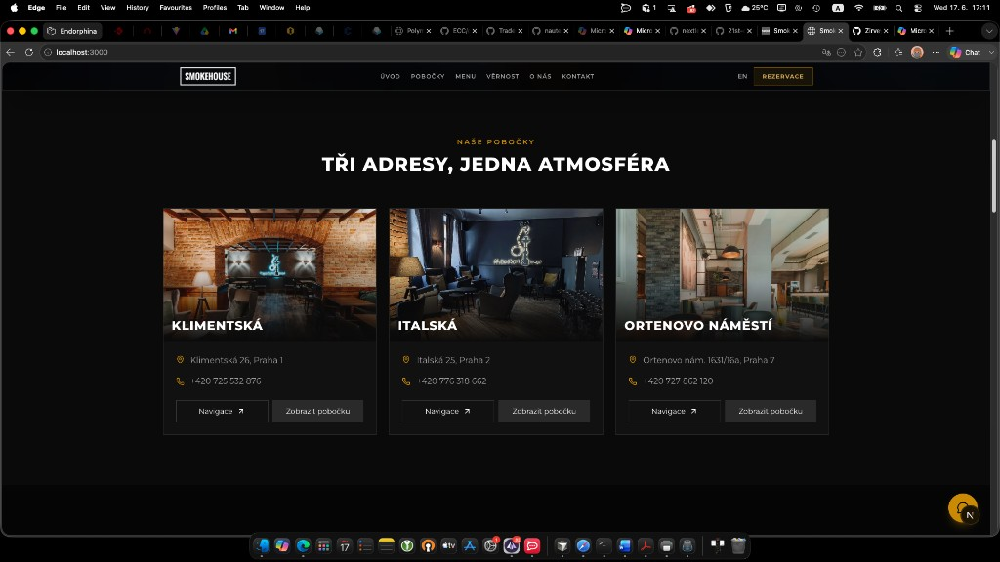
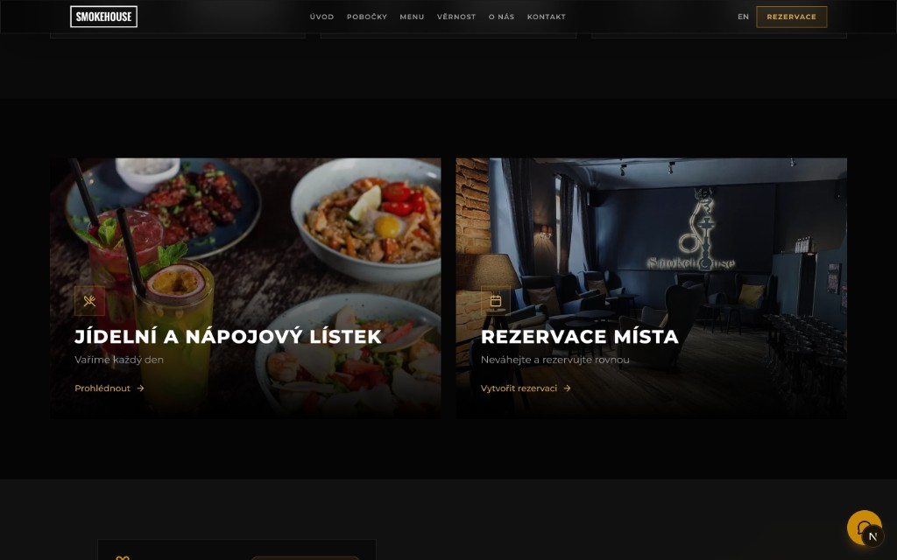
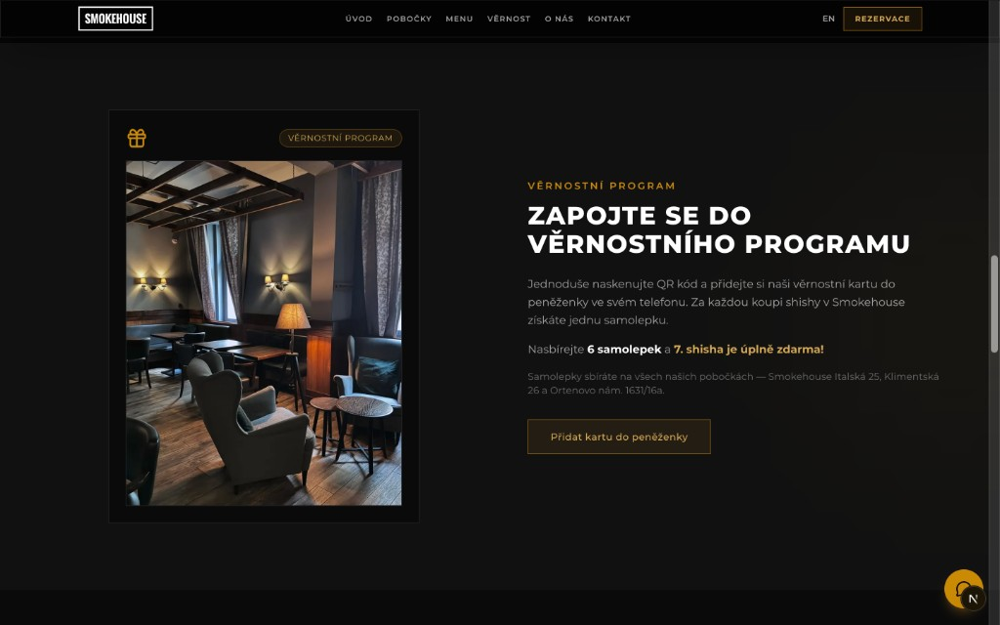
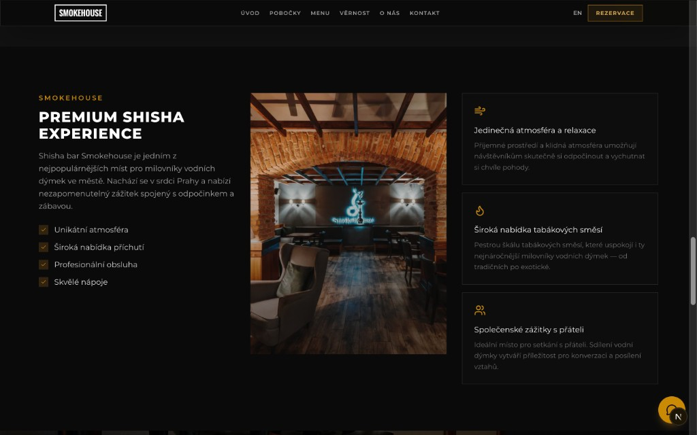
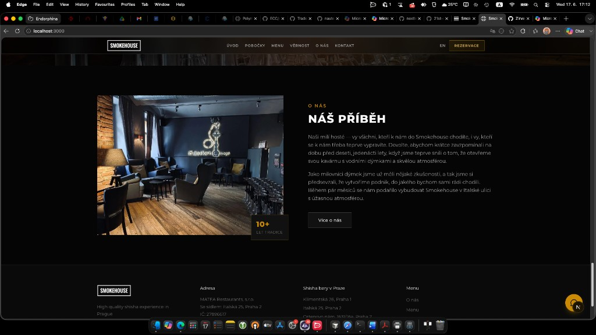

<p align="center">
  
</p>

<h1 align="center">Smokehouse Landing Page</h1>

<p align="center">
  Modern redesign concept for <a href="https://www.smokehouse.cz/">Smokehouse</a> — premium shisha lounge & restaurant in Prague.
</p>

<p align="center">
  
  
  
  
  
</p>

<br />

<p align="center">
  <video src="docs/hero-ember.mp4" autoplay loop muted playsinline width="100%"></video>
</p>
<p align="center"><sub>Hero — ember glow & particle effects</sub></p>

<br />

<p align="center">
  
</p>

<br />

## Overview

A dark, premium landing page for **Smokehouse** with three Prague locations. Built as a modern alternative to the current website — keeping brand identity, original photos, and Czech content while adding smooth animations and a cleaner layout.

| | |
|---|---|
| **Brand** | Dark lounge aesthetic, gold accents, original Smokehouse logo |
| **Content** | Czech language, 3 branches, menu, loyalty program, e-shop |
| **Assets** | Photos sourced from [smokehouse.cz](https://www.smokehouse.cz/) |

## Features

- **Hero** — parallax background, glowing ember particles, CTA buttons
- **Locations** — Klimentská, Italská, Ortenovo náměstí with real branch photos
- **Menu & Reservations** — split CTA blocks with hover effects
- **Loyalty program** — original poster from the official site
- **Features & About** — brand story and lounge highlights
- **E-shop banner** — link to [smokehouseshop.cz](https://www.smokehouseshop.cz/)
- **Responsive** — mobile-first layout, sticky navbar, scroll animations

## Screenshots

### Hero

<p align="center">
  <video src="docs/hero-ember.mp4" autoplay loop muted playsinline width="100%"></video>
</p>
<p align="center"><sub>Ember particles & glow animation</sub></p>

<p align="center">
  
</p>

### Pobočky

<p align="center">
  
</p>

### Menu & Rezervace

<p align="center">
  
</p>

### Věrnostní program

<p align="center">
  
</p>

### Premium experience

<p align="center">
  
</p>

### E-shop & O nás

<p align="center">
  
</p>

## Tech Stack

| Layer | Technology |
|-------|------------|
| Framework | [Next.js 15](https://nextjs.org/) (App Router) |
| Language | TypeScript |
| Styling | Tailwind CSS 4 |
| Animation | Framer Motion |
| Icons | Lucide React |
| Font | Montserrat (Proxima Nova alternative) |

## Getting Started

### Prerequisites

- Node.js 20+
- npm

### Install & run

```bash
git clone https://github.com/Zirvey/smokehouse-desing.git
cd smokehouse-desing
npm install
npm run dev
```

Open **[http://localhost:3000](http://localhost:3000)** in your browser.

### Build for production

```bash
npm run build
npm start
```

## Project Structure

```
├── public/
│   ├── images/          # Hero, menu, e-shop assets
│   ├── locations/       # Branch photos (from smokehouse.cz)
│   └── logo.png         # Official Smokehouse logo
├── src/
│   ├── app/             # Next.js app router
│   ├── components/      # UI sections (Hero, Navbar, Footer…)
│   └── lib/images.ts    # Image path constants
└── docs/                # README screenshots
```

## Sections

| Section | ID | Description |
|---------|-----|-------------|
| Úvod | `#uvod` | Hero with 3 branches |
| Pobočky | `#pobocky` | Location cards |
| Menu | `#menu` | Food & drinks CTA |
| Věrnost | `#vernost` | Loyalty program |
| O nás | `#onas` | Brand story |
| Kontakt | `#kontakt` | Footer & contacts |

## Author

**Zirvey** — [GitHub](https://github.com/Zirvey)

---

<p align="center">
  <sub>Design concept · Not affiliated with Smokehouse official website</sub>
</p>
